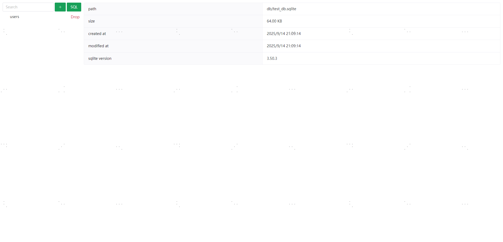
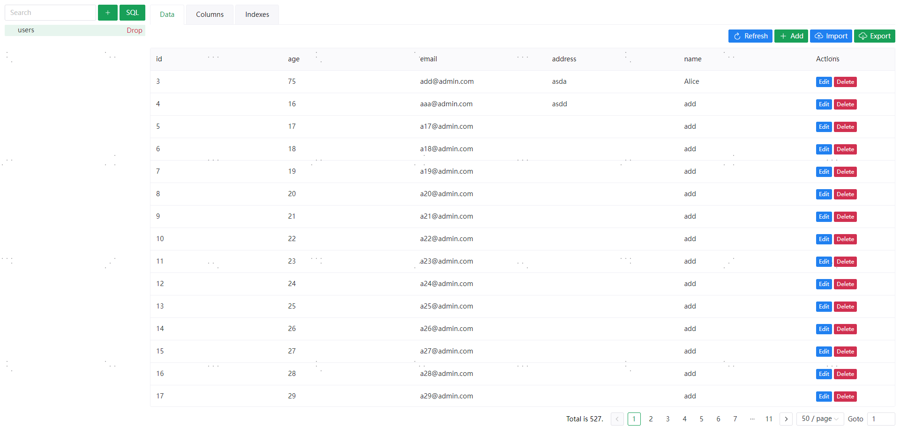
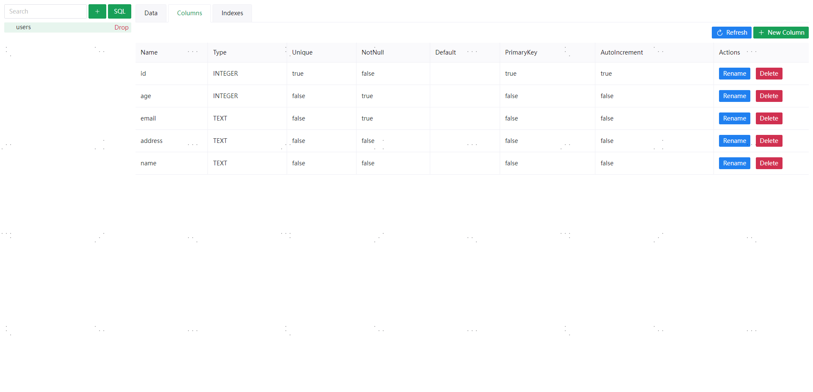
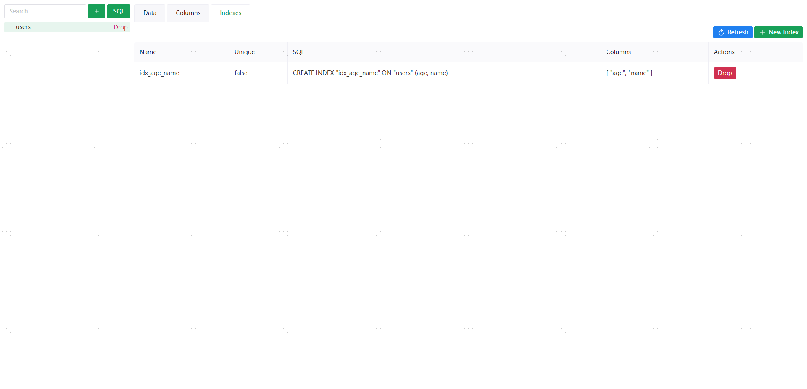
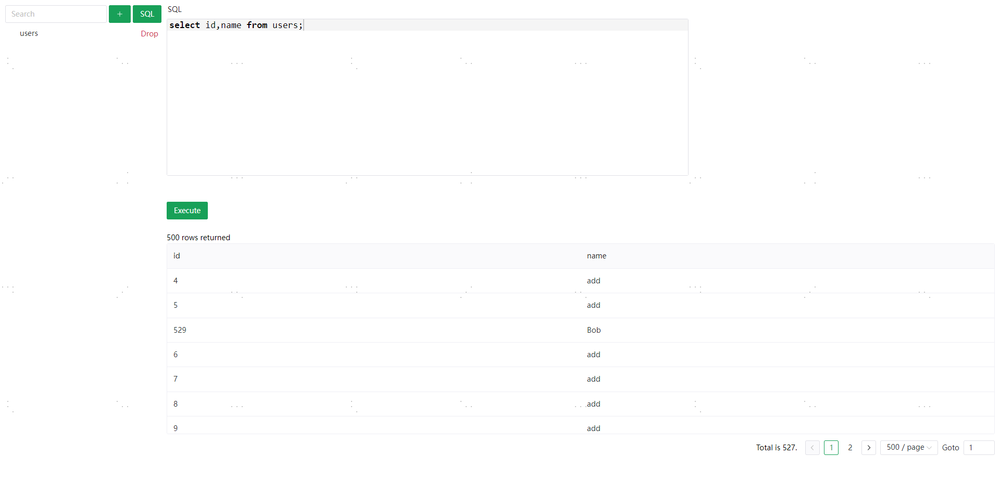

### 一个简单的 sqlite 管理工具


[release页面](https://github.com/fuxingjun/go-sqlite-web/releases/) 下载对应平台文件即可使用

以下是一些常用命令, 以 windows 为例
```bash
# 查看帮助
go_sqlite_web_windows_amd64.exe -h

# 运行程序, 监听 10049 端口, 数据库文件为当前目录下的 db/test.sqlite, 也是不带任何参数的默认行为
go_sqlite_web_windows_amd64.exe -db db/test.sqlite -port 12249

# 运行程序, 开启调试模式, 会输出更多日志
go_sqlite_web_windows_amd64.exe -db test.sqlite -port 12249 -debug
```

### TODO
- [ ] 权限认证
- [ ] readonly 模式
- [ ] 跨平台测试

### 截图展示
<a href="./docs/images/index.png" target="_blank" title="点击查看大图">
  
</a>
<a href="./docs/images/tableData.png" target="_blank" title="点击查看大图">
  
</a>
<a href="./docs/images/tableColumns.png" target="_blank" title="点击查看大图">
  
</a>
<a href="./docs/images/tableIndexs.png" target="_blank" title="点击查看大图">
  
</a>
<a href="./docs/images/query.png" target="_blank" title="点击查看大图">
  
</a>